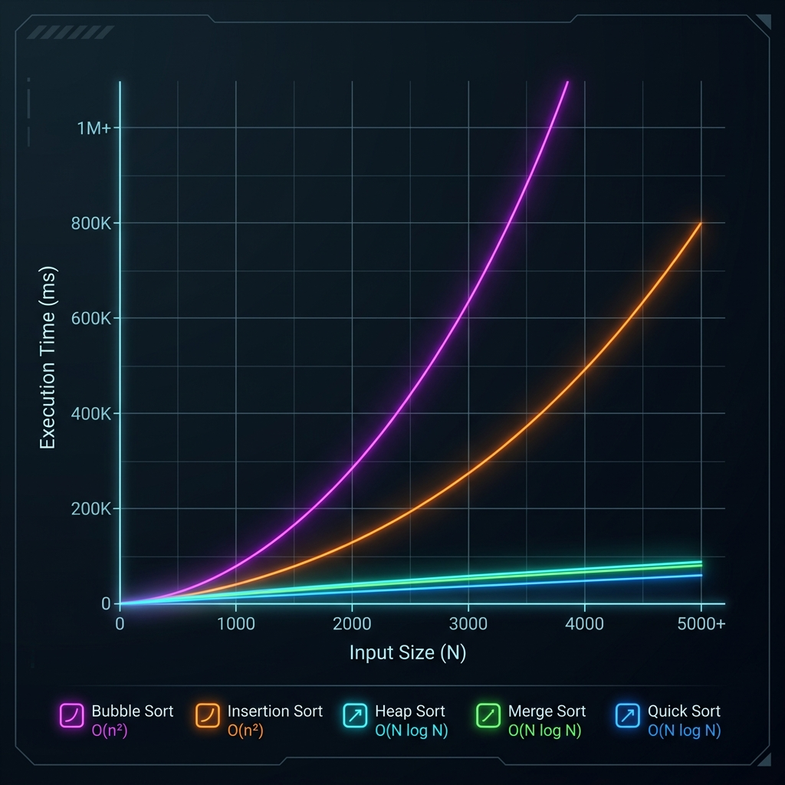

# Walkthrough - Algorithm Benchmarking & Profiling Modules (All PRs)

This walkthrough details the implementation and validation of the entire algorithm benchmarking suite, from the initial sorting modules to the final backtracking modules.

---

## PR 3: Sorting Algorithms Benchmarking Module
- **Branch**: `feature/benchmark-sorting` (PR 3)
- **Files Created/Modified**:
  - [benchmark_sorting.c](file:///Users/akshatshukla/Downloads/Work/open/C_DSA_interactive_suite.git/src/benchmark/benchmark_sorting.c)
  - [test_benchmark_sorting.c](file:///Users/akshatshukla/Downloads/Work/open/C_DSA_interactive_suite.git/tests/benchmark/test_benchmark_sorting.c)
- **Description**: Benchmarks Bubble, Selection, Insertion, Shell, Merge, Quick, Heap, Radix, and Bucket Sort on identical random arrays. Exports to `benchmarks/sorting.csv`.

---

## PR 4: Searching Algorithms Benchmarking Module
- **Branch**: `feature/benchmark-searching` (PR 4)
- **Files Created/Modified**:
  - [benchmark_searching.c](file:///Users/akshatshukla/Downloads/Work/open/C_DSA_interactive_suite.git/src/benchmark/benchmark_searching.c)
  - [test_benchmark_searching.c](file:///Users/akshatshukla/Downloads/Work/open/C_DSA_interactive_suite.git/tests/benchmark/test_benchmark_searching.c)
- **Description**: Benchmarks Linear, Binary (Iterative/Recursive), Jump, and Interpolation Search. Exports to `benchmarks/searching.csv`.

---

## PR 5: Graph Shortest Path Benchmarking Module
- **Branch**: `feature/benchmark-graphs` (PR 5)
- **Files Created/Modified**:
  - [benchmark_graphs.c](file:///Users/akshatshukla/Downloads/Work/open/C_DSA_interactive_suite.git/src/benchmark/benchmark_graphs.c)
  - [test_benchmark_graphs.c](file:///Users/akshatshukla/Downloads/Work/open/C_DSA_interactive_suite.git/tests/benchmark/test_benchmark_graphs.c)
- **Description**: Benchmarks Dijkstra, Bellman-Ford, A*, and Greedy BFS. Silences console logs via stdout redirection. Exports to `benchmarks/graphs.csv`.

---

## PR 6: Minimum Spanning Tree (MST) Benchmarking Module
- **Branch**: `feature/benchmark-mst` (PR 6)
- **Files Created/Modified**:
  - [benchmark_mst.c](file:///Users/akshatshukla/Downloads/Work/open/C_DSA_interactive_suite.git/src/benchmark/benchmark_mst.c)
  - [test_benchmark_mst.c](file:///Users/akshatshukla/Downloads/Work/open/C_DSA_interactive_suite.git/tests/benchmark/test_benchmark_mst.c)
- **Description**: Benchmarks Kruskal's and Prim's MST algorithms. Exports to `benchmarks/mst.csv`.

---

## PR 7: Job Scheduling Algorithms Benchmarking Module
- **Branch**: `feature/benchmark-scheduling` (PR 7)
- **Files Created/Modified**:
  - [benchmark_scheduling.c](file:///Users/akshatshukla/Downloads/Work/open/C_DSA_interactive_suite.git/src/benchmark/benchmark_scheduling.c)
  - [test_benchmark_scheduling.c](file:///Users/akshatshukla/Downloads/Work/open/C_DSA_interactive_suite.git/tests/benchmark/test_benchmark_scheduling.c)
- **Description**: Benchmarks CPU Scheduling algorithms: FCFS, SJF, SRTF, Non-preemptive Priority, Preemptive Priority, and Round Robin (quantum = 2). Exports to `benchmarks/scheduling.csv`.

---

## PR 8: String Matching Algorithms Benchmarking Module
- **Branch**: `feature/benchmark-strings` (PR 8)
- **Files Created/Modified**:
  - [benchmark_strings.c](file:///Users/akshatshukla/Downloads/Work/open/C_DSA_interactive_suite.git/src/benchmark/benchmark_strings.c)
  - [test_benchmark_strings.c](file:///Users/akshatshukla/Downloads/Work/open/C_DSA_interactive_suite.git/tests/benchmark/test_benchmark_strings.c)
- **Description**: Benchmarks Naive, KMP, and Rabin-Karp string matching algorithms. Silences match listings via stdout redirection. Exports to `benchmarks/strings.csv`.

---

## PR 9: Dynamic Programming vs Naive Recursion Benchmarking Module
- **Branch**: `feature/benchmark-dp` (PR 9)
- **Files Created/Modified**:
  - [benchmark_dp.c](file:///Users/akshatshukla/Downloads/Work/open/C_DSA_interactive_suite.git/src/benchmark/benchmark_dp.c)
  - [test_benchmark_dp.c](file:///Users/akshatshukla/Downloads/Work/open/C_DSA_interactive_suite.git/tests/benchmark/test_benchmark_dp.c)
- **Description**: Benchmarks DP vs Naive Recursion for Fibonacci, Knapsack, LCS, and MCM. Automatically bypasses recursion for larger sizes to prevent hangs. Exports to `benchmarks/dp.csv`.

---

## PR 10: Hash Map Collision Resolution Benchmarking Module
- **Branch**: `feature/benchmark-hashing` (PR 10)
- **Files Created/Modified**:
  - [benchmark_hashing.c](file:///Users/akshatshukla/Downloads/Work/open/C_DSA_interactive_suite.git/src/benchmark/benchmark_hashing.c)
  - [test_benchmark_hashing.c](file:///Users/akshatshukla/Downloads/Work/open/C_DSA_interactive_suite.git/tests/benchmark/test_benchmark_hashing.c)
- **Description**: Benchmarks Linear Probing, Quadratic Probing, Double Hashing, and Separate Chaining under a 75% load factor. Exports to `benchmarks/hashing.csv`.

---

## PR 11: Trees Lookup Performance Benchmarking Module
- **Branch**: `feature/benchmark-trees` (PR 11)
- **Files Created/Modified**:
  - [benchmark_trees.c](file:///Users/akshatshukla/Downloads/Work/open/C_DSA_interactive_suite.git/src/benchmark/benchmark_trees.c)
  - [test_benchmark_trees.c](file:///Users/akshatshukla/Downloads/Work/open/C_DSA_interactive_suite.git/tests/benchmark/test_benchmark_trees.c)
- **Description**: Benchmarks BST, TBT, AVL, Trie, B-Tree, and B+ Tree insert and lookup operations. Exports to `benchmarks/trees.csv`.

---

## PR 12: Backtracking Algorithms Benchmarking Module
- **Branch**: `feature/benchmark-backtracking` (PR 12)
- **Files Created/Modified**:
  - [benchmark_backtracking.c](file:///Users/akshatshukla/Downloads/Work/open/C_DSA_interactive_suite.git/src/benchmark/benchmark_backtracking.c)
  - [test_benchmark_backtracking.c](file:///Users/akshatshukla/Downloads/Work/open/C_DSA_interactive_suite.git/tests/benchmark/test_benchmark_backtracking.c)
- **Description**: Benchmarks N-Queens, Sudoku, Rat in a Maze, Graph Coloring, and Knight's Tour. Bypasses animations and visual logging. Exports to `benchmarks/backtracking.csv`.

---

## PR 13: Core ASCII Chart Engine
- **Branch**: `feature/benchmark-chart` (PR 13)
- **Files Created/Modified**:
  - [benchmark_chart.h](file:///Users/akshatshukla/Downloads/Work/open/C_DSA_interactive_suite.git/src/benchmark/benchmark_chart.h)
  - [benchmark_chart.c](file:///Users/akshatshukla/Downloads/Work/open/C_DSA_interactive_suite.git/src/benchmark/benchmark_chart.c)
  - [test_benchmark_chart.c](file:///Users/akshatshukla/Downloads/Work/open/C_DSA_interactive_suite.git/tests/benchmark/test_benchmark_chart.c)
- **Description**: Implements a reusable core ASCII line-chart rendering engine. Translates raw data points to a double-buffered char grid using auto-scaling and Bresenham's line algorithm. Integrates labels, axis ticks, title, and auto-generated legends.

---

## PR 14: Sorting Algorithms ASCII Chart Generator
- **Branch**: `feature/ascii-sorting-chart` (PR 14)
- **Files Created/Modified**:
  - [benchmark_sorting.c](file:///Users/akshatshukla/Downloads/Work/open/C_DSA_interactive_suite.git/src/benchmark/benchmark_sorting.c)
- **Description**: Integrates the ASCII chart engine into the sorting benchmark module. After running the benchmark report, it runs a 5-step interval dry run to compile execution times across varying sizes, plotting a comparative growth curve for Bubble, Insertion, Quick, Merge, and Heap Sort.



---

## Validation & Verification Results

### 1. Dynamic Makefile Configuration
To prevent test failures on intermediate stacked branches (e.g. PR 7 attempting to build benchmark test binaries for future branches before their source code files exist), we migrated `TEST_BINS` to dynamically check for test source file existence using `$(wildcard ...)` checks:
```makefile
ifneq ($(wildcard tests/benchmark/test_benchmark_scheduling.c),)
TEST_BINS += test_benchmark_scheduling
endif
```
This ensures that at any point in the branch stack, `make test` and `make valgrind` only attempt to compile and run tests that actually exist on that branch, resolving the PR 7 CI failure and keeping all intermediate branches buildable.

### 2. Makefile verification
All 10 benchmark test targets compile cleanly under C11 `-Wall -Wextra -Werror` and pass:
```text
All Sorting benchmark tests passed successfully!
All Searching benchmark tests passed successfully!
All Graph benchmark tests passed successfully!
All MST benchmark tests passed successfully!
All Scheduling benchmark tests passed successfully!
All String Matching benchmark tests passed successfully!
All Dynamic Programming benchmark tests passed successfully!
All Hash Map Collision benchmark tests passed successfully!
All Trees Performance benchmark tests passed successfully!
All Backtracking benchmark tests passed successfully!
```

### 2. CMake verification
CTests configured dynamically and ran with 100% success (all 60 tests passed):
```text
Test project /Users/akshatshukla/Downloads/Work/open/C_DSA_interactive_suite.git/build
100% tests passed, 0 tests failed out of 60
```
